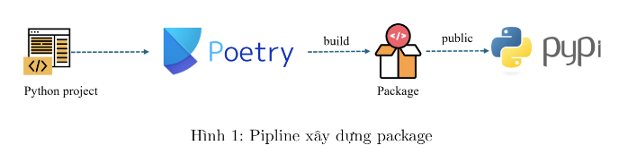

# build-package


## Cài đặt thư viện Poetry
Poetry là một công cụ quản lý các package, library phụ thuộc trong môi trường riêng biệt để phát triển các dự án python, nó cung cấp các chức năng thuận tiện cho việc xây dựng package python và phát hành lên nền tảng PyPI

***window***

`py -m pip install --user pipx`

`pipx install poetry`

`poetry --version`

--> done

## Thiết lập dự án

- Để tạo một dự án mới:

`poetry new xinchao`

nó sẽ tạo ra dự án có cấu trúc

``` 
| pyproject.toml
| README.md
|
|---src
|     xinchao
|         __init__.py 
|---tests
|         __init__.py
```

* ***xinchao***: viết code tạo package ở đây
* ***tests***: viết code kiểm thử
* *pyproject.toml*: là file chứa thông tin cấu hình package 


`poetry publish --build`

https://pypi.org/project/xinchao/